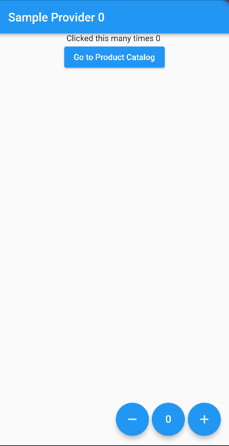

# Lecture 09 - State Management

This is a lecture sample code for CMSC 23 C and D Sections.

## Created by
- Katherine Loren Tan
- 18 October 2022
- For CMSC 23 C and D, State Management Sample

## Description and Components

The program's screens, providers, and model are separated into folders. This is to ensure that the screens will only show the UI structure of the app. The providers will only return the necessary changes and updates on the page and the model for the class objects.

## Screenshots of the App

- HomePage

- ProductCatalog

    - Click Add Product to Shopping Cart
    
- Cart

    - Shopping Cart with Items
    
    - Shopping Cart Remove Item All
    
    - Shopping Cart Buy
    

## Contact Me
For questions and inquiries kindly email me at **kmtan4@up.edu.ph**